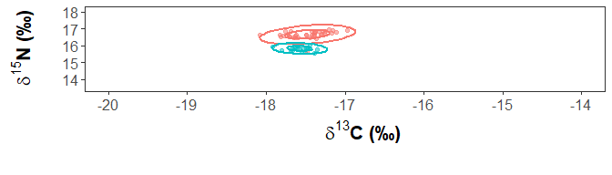

<!-- README.md is generated from README.Rmd. Please edit that file -->

# isoseabird

<!-- badges: start -->
<!-- badges: end -->

A package to analyse isotopic niche overlaps in seabirds

It provides data and uses functions from other packages to create a
workflow. Please see references to refer to the packages.

# Intro

This package contains:

-   Data from stable isotopes from red-footed and masked boobies from
    Isla Clarion

-   Eleven functions to organize your data and to calculate Mean
    distance to centroid and Euclidian distance, adapted from Turner et
    al. 2010

-   Four functions to organize, convert objects and calculate proportion
    of overlap using the package SIBER

-   Six functions to plot ellipses using ggplot and to adapt the theme

## Install package

``` r
# install.packages("devtools")
devtools::install_github("MiriamLL/isoseabird")
```

Load package

``` r
library('isoseabird')
```

# Data

Contains C and N isotopic blood data from red-footed and masked boobies
breeding at Clarion Island

``` r
head(Sula_data)
```

``` r
Sula_data<-Sula_data
```

# 1. Turner

Contains functions from Turner et al 2010  
A general hypothesis-testing framework for stable isotope ratios in
ecological studies  
Ecology 91(8):2227-33

Please refer to [Turner et
al. 2010](https://esapubs.org/archive/ecol/E091/157/)  
For details on the script go to: [R
Files](https://esapubs.org/archive/ecol/E091/157/suppl-1.htm)

## 1.1. organize_for_Turner

``` r
SIA_Turner<-organize_for_Turner(SIA_samples=Sula_data,
                                column_C='Carbon',
                                column_N='Nitrogeno',
                                column_group='Species')
```

## 1.2. plot_centroids

``` r
plot_centroids(SIA_samples=Sula_data,
               column_C='Carbon',
               column_N='Nitrogeno',
               column_group='Species',
               group1="SulaSula",
               group2="Dactylatra")
```


## 1.3. create_matrix

``` r
SIA_matrix<-create_matrix(SIA_Turner = SIA_Turner)
```

## 1.4. Calculate_residuals

``` r
SIA_residuals<-calculate_residuals(SIA_matrix=SIA_matrix,
                                      SIA_group = SIA_group)
```

## 1.5. dispersion_measures

``` r
SIA_dispersion<-calculate_dispersion(SIA_residuals = SIA_residuals,
                                     SIA_group=SIA_group)
```

## 1.6. dispersion statistics

``` r
SIA_tabledispersion<-dispersion_statistics(SIA_dispersion=SIA_dispersion,
                                           SIA_group=SIA_group)
SIA_tabledispersion
#>               mdc        mnn       ecc
#> Group.1 0.2710001 0.07889044 0.5048015
#> Group.2 0.1568367 0.06918786 0.2823182
```

## 1.7. calculate_means

``` r
SIA_means<-calculate_means(SIA_matrix,SIA_group)
SIA_means
#>    column_C column_N
#> 1 -17.47543 16.66400
#> 2 -17.57423 15.82836
```

``` r
SIA_meandif<-as.vector(dist(as.matrix(SIA_means)))
SIA_meandif
#> [1] 0.8414562
```

## 1.8. contrasting differences

``` r
SIA_dispersiondif<-contrast_differences(SIA_tabledispersion = SIA_tabledispersion)
SIA_dispersiondif
#> $mdc
#>       dis 
#> 0.1141634 
#> 
#> $mnn
#>         dis 
#> 0.009702583 
#> 
#> $ecc
#>       dis 
#> 0.2224833
```

``` r
SIA_dispersiondif$mdc
#>       dis 
#> 0.1141634
```

## 1.9. permutation procedure

``` r
SIA_permutation<-run_permutation(SIA_matrix=SIA_matrix, 
                                 SIA_group=SIA_group,
                                 SIA_dispersiondif = SIA_dispersiondif,
                                 permutation_runs=999)
```

## 1.10. calculate_pvalues

``` r
SIA_pvalue<-calculate_pvalues(SIA_permutation=SIA_permutation)
SIA_pvalue
#>  MD.1--2 MDC.1--2 MNN.1--2 ECC.1--2 
#>    0.001    0.009    0.698    0.504
```

## 1.11. hotellings

*Hotellings revealed that Euclidian distance between centroids differed
significantly from zero for contrast between guilds (Turner et
al. 2010)*

``` r
SIA_hotellings<-calculate_hotellings(SIA_means=SIA_means,
                               SIA_group=SIA_group,
                               SIA_matrix=SIA_matrix)
SIA_hotellings
#>      [,1]
#> [1,]    0
```

# 2. SIBER

Creates work flow to use the package SIBER to calculate ellipses
overlaps.

Refer to the paper: [Jackson et
al. 2011](https://besjournals.onlinelibrary.wiley.com/doi/full/10.1111/j.1365-2656.2011.01806.x)  
Check for updates on: [SIBER - last update
2023](https://cran.r-project.org/web/packages/SIBER/vignettes/Introduction-to-SIBER.html)

## 2.1. organize_for_SIBER

``` r
SIBER_SIA<-organize_for_SIBER(SIA_samples=Sula_data,
                              column_C='Carbon',
                              column_N='Nitrogeno',
                              column_group='Species')
```

## 2.2. convert_object

``` r
SIBER_object<-convert_object(SIBER_SIA=SIBER_SIA)
str(SIBER_object)
#> List of 12
#>  $ original.data  :'data.frame': 59 obs. of  4 variables:
#>   ..$ iso1     : num [1:59] -17.5 -17.5 -17.4 -17.6 -17.4 ...
#>   ..$ iso2     : num [1:59] 15.8 15.9 15.8 16 16 ...
#>   ..$ group    : Factor w/ 2 levels "Dactylatra","SulaSula": 2 2 2 2 2 2 2 2 2 2 ...
#>   ..$ community: Factor w/ 1 level "1": 1 1 1 1 1 1 1 1 1 1 ...
#>  $ all.groups     : chr [1:2] "Dactylatra" "SulaSula"
#>  $ all.communities: chr "1"
#>  $ iso.summary    : num [1:4, 1:2] -18.1 -17 -17.5 -17.5 15.6 ...
#>   ..- attr(*, "dimnames")=List of 2
#>   .. ..$ : chr [1:4] "min" "max" "mean" "median"
#>   .. ..$ : chr [1:2] "iso1" "iso2"
#>  $ sample.sizes   : int [1, 1:2] 37 22
#>   ..- attr(*, "dimnames")=List of 2
#>   .. ..$ : chr "1"
#>   .. ..$ : chr [1:2] "Dactylatra" "SulaSula"
#>  $ raw.data       :List of 1
#>   ..$ 1:'data.frame':    59 obs. of  4 variables:
#>   .. ..$ iso1     : num [1:59] -17.5 -17.5 -17.4 -17.6 -17.4 ...
#>   .. ..$ iso2     : num [1:59] 15.8 15.9 15.8 16 16 ...
#>   .. ..$ group    : Factor w/ 2 levels "Dactylatra","SulaSula": 2 2 2 2 2 2 2 2 2 2 ...
#>   .. ..$ community: Factor w/ 1 level "1": 1 1 1 1 1 1 1 1 1 1 ...
#>  $ n.communities  : int 1
#>  $ n.groups       : int [1:2, 1] 1 2
#>   ..- attr(*, "dimnames")=List of 2
#>   .. ..$ : chr [1:2] "community" "n.groups"
#>   .. ..$ : chr ""
#>  $ ML.mu          :List of 1
#>   ..$ 1: num [1, 1:2, 1:2] -17.6 15.8 -17.5 16.7
#>   .. ..- attr(*, "dimnames")=List of 3
#>   .. .. ..$ : NULL
#>   .. .. ..$ : chr [1:2] "iso1" "iso2"
#>   .. .. ..$ : chr [1:2] "SulaSula" "Dactylatra"
#>  $ ML.cov         :List of 1
#>   ..$ 1: num [1:2, 1:2, 1:2] 0.01744 -0.00263 -0.00263 0.01589 0.05671 ...
#>   .. ..- attr(*, "dimnames")=List of 3
#>   .. .. ..$ : chr [1:2] "iso1" "iso2"
#>   .. .. ..$ : chr [1:2] "iso1" "iso2"
#>   .. .. ..$ : chr [1:2] "SulaSula" "Dactylatra"
#>  $ group.names    :List of 1
#>   ..$ : Factor w/ 2 levels "Dactylatra","SulaSula": 2 1
#>  $ zscore.data    :List of 1
#>   ..$ 1:'data.frame':    59 obs. of  4 variables:
#>   .. ..$ iso1     : num [1:59, 1] 0.358 0.82 1.668 -0.248 0.963 ...
#>   .. ..$ iso2     : num [1:59, 1] 0.164 0.394 -0.526 1.044 1.568 ...
#>   .. ..$ group    : Factor w/ 2 levels "Dactylatra","SulaSula": 2 2 2 2 2 2 2 2 2 2 ...
#>   .. ..$ community: Factor w/ 1 level "1": 1 1 1 1 1 1 1 1 1 1 ...
```

``` r
SIBER_group<-SIBER::groupMetricsML(SIBER_object)
SIBER_group
#>      1.SulaSula 1.Dactylatra
#> TA   0.17262350    0.7365135
#> SEA  0.05164064    0.1596746
#> SEAc 0.05422268    0.1642368
```

## 2.3. overlap_ellipses

This function organizes the data and uses the function
[maxLikOverlap](https://search.r-project.org/CRAN/refmans/SIBER/html/maxLikOverlap.html)

``` r
SIBER_overlap_50<-areas_overlap(SIBER_object = SIBER_object,
                              group1<-'SulaSula',
                              group2<-'Dactylatra',
                              overlap = 0.50)
SIBER_overlap_50
#>  area.1  area.2 overlap 
#>    0.08    0.23    0.00
```

``` r
SIBER_overlap_95<-areas_overlap(SIBER_object = SIBER_object,
                              group1<-'SulaSula',
                              group2<-'Dactylatra',
                              overlap = 0.95)
SIBER_overlap_95
#>  area.1  area.2 overlap 
#>    0.32    0.98    0.01
```

## 2.4. prop_overlap

``` r
prop_overlap_50<-proportion_overlap(area_overlap = SIBER_overlap_50)
prop_overlap_50
#> overlap 
#>       0
```

``` r
prop_overlap_95<-proportion_overlap(area_overlap = SIBER_overlap_95)
prop_overlap_95
#> overlap 
#>    0.01
```

# 3. Figure

``` r
Sula_data<-Sula_data
```

## 3.1. ggplot_ellipses

``` r
SIA_plot<-ggplot_ellipse(SIA_samples<-Sula_data,column_C<-'Carbon',column_N<-'Nitrogeno',
                         column_group<-'Species')
SIA_plot
```


## 3.2. adapt_axis

``` r
SIA_plot_axis<-adapt_axis(SIA_plot=SIA_plot,
                            C_breaks=c(-20,-19,-18,-17,-16,-15,-14),
                            C_limits=c(-20,-14),
                            N_breaks=c(14,15,16,17,18),
                            N_limits=c(13.5,18.1))
SIA_plot_axis
```


## 3.3. adapt_theme

``` r
SIA_plot_theme<-adapt_theme(SIA_plot=SIA_plot_axis)
SIA_plot_theme
```



## 3.4. adapt_legend

``` r
SIA_plot_legend<-adapt_legend(SIA_plot=SIA_plot_theme,
                       xlabel_adjust=-19.9,
                       ylabel_adjust=17.9,
                       label1='Masked booby',
                       label2='Red-footed booby',
                       color1='#233d4d',
                       color2='#2a9d8f')
SIA_plot_legend
```


## 3.5. adapt_colors

``` r
SIA_plot_colors<-adapt_colors(SIA_plot=SIA_plot_legend,
                              color1='#233d4d',
                              color2='#2a9d8f',
                              column_group='Species')
SIA_plot_colors
```


# 4. Overview

## Mean distance to centroid

``` r
SIA_dispersiondif$mdc
#>       dis 
#> 0.1141634
```

``` r
SIA_pvalue
#>  MD.1--2 MDC.1--2 MNN.1--2 ECC.1--2 
#>    0.001    0.009    0.698    0.504
```

## Euclidian distance

``` r
SIA_hotellings
#>      [,1]
#> [1,]    0
```

## Proportion of overlap

``` r
prop_overlap_50
#> overlap 
#>       0
prop_overlap_95
#> overlap 
#>    0.01
```

## Figure

``` r
SIA_plot_colors
```


## Export

``` r
ResultsFolder<-here::here("3Results")
SIA_plot_colors
ggsave("Fig2.jpg",
       path = ResultsFolder,
       width = 10, height = 10, 
       units = "in") 
```

# 5. References

[Hammerschlag-Peyer et
al. 2011](https://journals.plos.org/plosone/article?id=10.1371/journal.pone.0027104)

[Turner et al. 2010](https://esapubs.org/archive/ecol/E091/157/)  
[R Files](https://esapubs.org/archive/ecol/E091/157/suppl-1.htm)

[Jackson et
al. 2011](https://besjournals.onlinelibrary.wiley.com/doi/full/10.1111/j.1365-2656.2011.01806.x)  
[SIBER - last update
2023](https://cran.r-project.org/web/packages/SIBER/vignettes/Introduction-to-SIBER.html)  
[SIA in
ggplot2](https://cran.r-project.org/web/packages/SIBER/vignettes/Plot-SIA-ggplot2.html)
